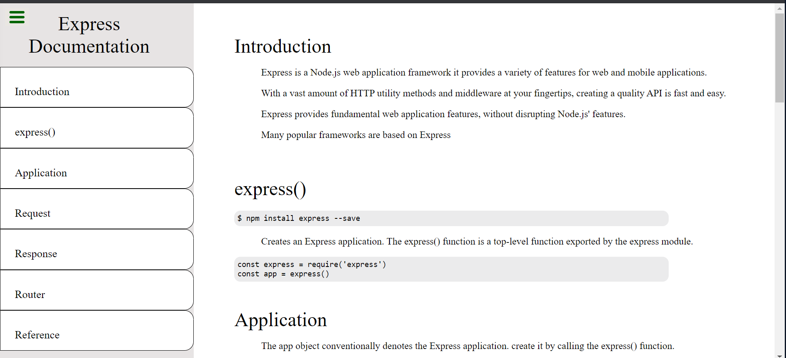
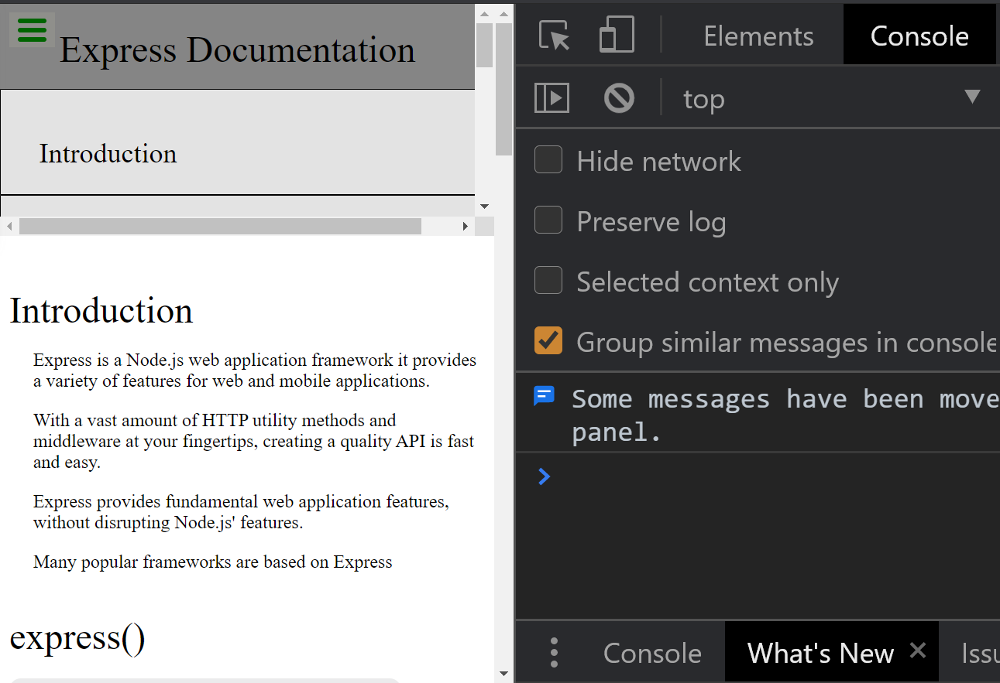
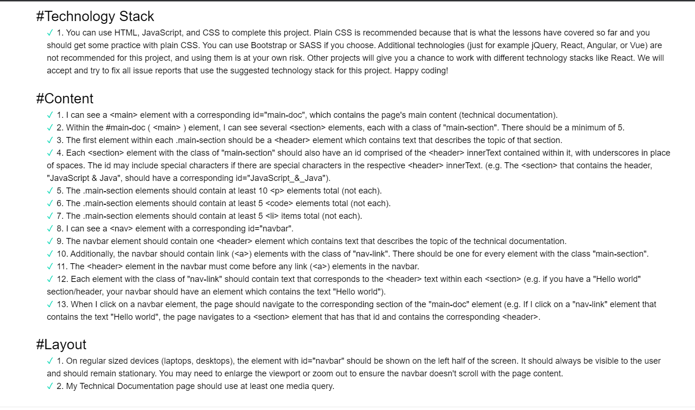

## Technical Documentation Page

## Description

A Responsive Technical Documentation page, achieved with plain CSS.

---

## Table of content

---

- [Description](#description)
- [Support/Questions](#supportquestions)
- [License](#license)

> **_get started_**:

- html
- CSS

---

---

---

> **_Find me on Github:_**

**_At Github:_**
<https://github.com/Rauloropesa3/technical_Documention-page.git>

**_or on the web:_**
<https://rauloropesa3.github.io/technical_Documention-page/>

- MIT License

  <https://opensource.org/license/>
